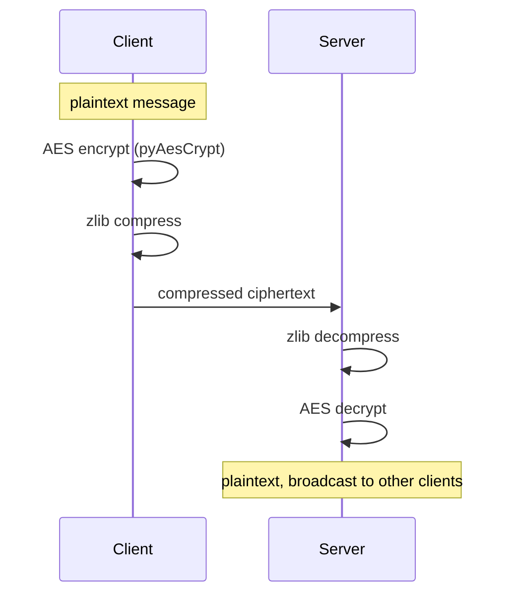

<div align="center">

# Covert Communications Server

**A compressed, AES-encrypted socket chat server built to study covert-channel and low-signature C2 communication patterns**


</div>

---

## Overview

This project implements a minimal multi-client chat server/client pair where every message is:

1. **Encrypted** with AES via [`pyAesCrypt`](https://pypi.org/project/pyAesCrypt/), then
2. **Compressed** with `zlib` before it ever touches the socket.

Compressing *after* encryption keeps frames small and shapes traffic away from the easily-fingerprinted plaintext-then-encrypt pattern, which matters when studying how command-and-control or exfiltration channels try to blend in on the wire. To a passive observer sniffing the socket, each frame is just a blob of compressed, encrypted bytes with no visible structure.

This is a research/education project for understanding encrypted-channel design, not a hardened production messaging system. See [Known Limitations](#known-limitations) below before relying on it for anything sensitive.

> ## ⚠️ Intended Use
> Built for authorized security research, red-team exercises, and learning about covert channel design in lab environments you own or are explicitly authorized to test in. Don't point it at systems or networks you don't control.

## How It Works



Encrypting before compressing (rather than the more common compress-then-encrypt) means a passive observer sniffing the socket only ever sees a blob of high-entropy bytes, no plaintext structure to fingerprint, and no separate "compression" and "encryption" layers to distinguish from each other.

## Features

- 🔐 **AES encryption** on every message, in both directions
- 📦 **Post-encryption zlib compression** to minimize on-wire footprint
- 👥 **Multi-client server** with per-client alias support
- 🖥️ **Cross-platform client** (Linux/macOS/Windows)

## Requirements

- Python 3.x
- Dependencies in [`requirements.txt`](requirements.txt) (`pyaescrypt`, `colorama`)

## Installation

```bash
git clone https://github.com/01xJB/Covert-Communications-Server.git
cd Covert-Communications-Server
pip install -r requirements.txt
```

<details>
<summary><strong>Windows setup (virtual environment)</strong></summary>

```powershell
python3 -m venv venv
# or, targeting a specific interpreter:
# C:\Users\USER\AppData\Local\Programs\PythonX\python.exe -m venv venv

.\venv\Scripts\activate
pip install -r requirements.txt
```

</details>

## Usage

Start the server:

```bash
python3 server.py
```

Connect a client:

```bash
python3 client.py
```

### Example Session

Two clients connected to the same server, chatting over the encrypted channel:

```
$ python3 client.py
Connected to 127.0.0.1:9001
[*] Enter the alias you wish to go by
:> 0xjb
[+] You are now known as 0xjb
0xjb@covert~# hey, you on?
[Server]:sh4dow:> yeah, just watching the traffic on wireshark
0xjb@covert~# nice, what's it look like on the wire?
[Server]:sh4dow:> just compressed ciphertext, no plaintext markers at all
0xjb@covert~#
```

```
$ python3 client.py
Connected to 127.0.0.1:9001
[*] Enter the alias you wish to go by
:> sh4dow
[+] You are now known as sh4dow
[Server]:0xjb:> hey, you on?
sh4dow@covert~# yeah, just watching the traffic on wireshark
[Server]:0xjb:> nice, what's it look like on the wire?
sh4dow@covert~# just compressed ciphertext, no plaintext markers at all
sh4dow@covert~#
```

## Known Limitations

This is a proof-of-concept, not a hardened tool. Before using it for anything beyond a lab:

- **The AES password is hardcoded** (`"secret"`) in both `client.py` and `server.py`. Anyone with the source has the key, so change it to a value shared out-of-band before relying on confidentiality.
- **No authentication**: any client that can reach the port can join and broadcast.
- **No transport integrity checks** beyond what AES/zlib provide incidentally. There's no message authentication (MAC) layer.

If you build on this, parameterizing the password (env var / CLI flag) and adding per-session key exchange are the first things worth fixing.

## License

Released under [CC0 1.0 (Public Domain)](LICENSE).

---

<div align="center">

Built by [**01xJB**](https://github.com/01xJB)

</div>
